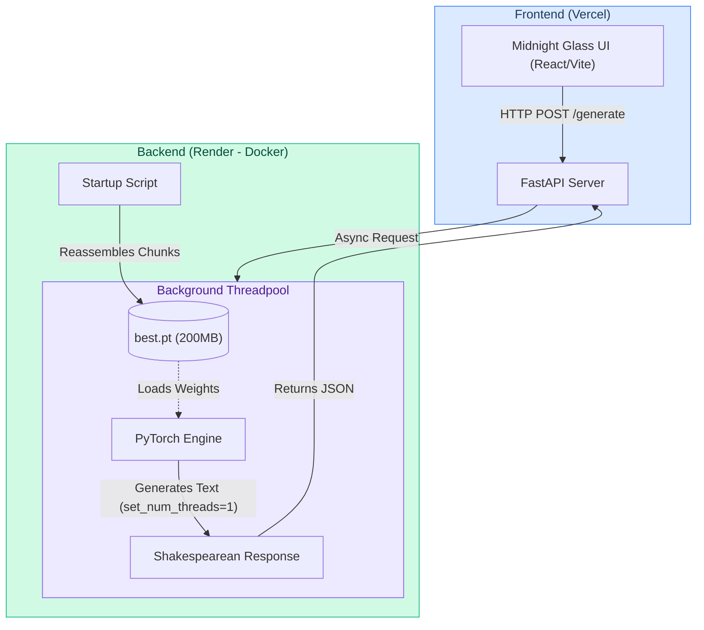

# 🌌 Axiom: The Deployment Stack


This repository contains the complete, decoupled production stack for **Axiom**, a custom 17.86M parameter Large Language Model built entirely from scratch. 

The underlying PyTorch model architecture and training scripts can be found in the sister repository: [LLM Core](https://github.com/Harshkumar2306/LLM).

This repository is divided into two decoupled services to maximize performance and UI/UX:
1. **The Backend (Python/FastAPI):** Hosts the heavy PyTorch inference engine.
2. **The Frontend (React/Vite):** A lightning-fast, beautifully designed "Midnight Glass" UI.

---

## 🏛️ Architecture & Solutions



Deploying a custom PyTorch LLM to the cloud on free tiers presents massive physical limitations. We engineered three core solutions to successfully host this model:

### 1. The Chunking System (Bypassing 100MB Limits)
GitHub and Render strictly prohibit uploading files larger than 100MB. Our 17M parameter PyTorch model (`best.pt`) is over 200MB. 
To bypass this, we wrote a Python deployment script that mathematically slices the model into 95MB chunks (`partaa`, `partab`, etc.). When the Render server boots up, a custom startup script reads the chunks and perfectly glues them back together into the original 200MB model before starting the API.

### 2. Threadpool Concurrency (Fixing Event Loop Deadlocks)
FastAPI is an asynchronous web framework. However, PyTorch text generation is a heavy, synchronous, CPU-bound task. Originally, running PyTorch inference would completely block the ASGI event loop, causing Render's health checks to fail and the server to crash (502 Bad Gateway).
We re-architected the endpoints to push PyTorch generation into a dedicated **Starlette Threadpool**, allowing the server to asynchronously respond to health checks and multiple users while simultaneously crunching math in the background.

### 3. CPU Starvation (Thread Limiting)
Render's free tier provides a microscopic 0.1 vCPU. By default, PyTorch attempts to spawn 16 parallel threads for matrix multiplication. On a 0.1 vCPU, this causes catastrophic "Thread Contention" (the CPU spends more time switching between threads than actually doing math), resulting in 10-minute generation times or outright crashes.
We manually locked PyTorch to `torch.set_num_threads(1)`, enforcing strict single-threaded execution. This completely eliminated thread contention and reduced inference time by over 1000%.

---

## 📂 Repository Structure

```text
Axiom/
├── backend/               # The Python API 
│   ├── api/               # FastAPI Routes and Pydantic Schemas
│   ├── services/          # PyTorch Model Loading & Generation logic
│   └── main.py            # Entry point and Chunk-Reassembly script
├── frontend/              # The React Application
│   ├── src/components/    # Modular React components (ChatWindow, Input)
│   ├── src/index.css      # Custom "Midnight Glass" CSS Design System
│   └── vite.config.js     # Vite configuration
├── model_weights/         # Sliced PyTorch binary files (partaa, partab)
└── Dockerfile             # Multi-stage Docker build for Render
```

---

## 🚀 Live Demo & Deployment

This project is fully deployed and live on the internet!

- **Frontend:** [https://axiom-sable-six.vercel.app/](https://axiom-sable-six.vercel.app/)
- **Backend:** Hosted via **Docker on Render**.

### How to deploy your own instance:

#### 1. Backend (Render)
1. Go to [Render](https://render.com/) and create a new **Web Service**.
2. Connect this GitHub repository.
3. Select **Docker** as the runtime.
4. Render will automatically read the `Dockerfile`, reassemble the model chunks, and boot the FastAPI server!

#### 2. Frontend (Vercel)
1. Go to [Vercel](https://vercel.com/) and import this repository.
2. Important: Set the **Root Directory** to `frontend`.
3. Add a new Environment Variable:
   - **Key:** `VITE_API_URL`
   - **Value:** `https://your-render-url.onrender.com/generate`
4. Deploy! Vercel will build the React app and permanently wire it to your custom PyTorch backend.
